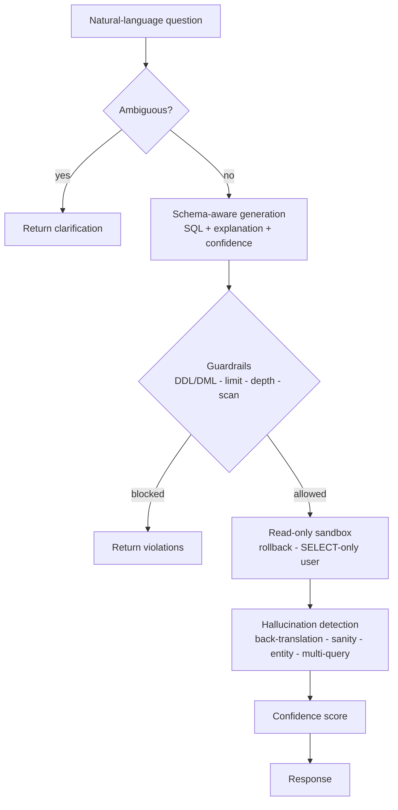

# Text-to-SQL with Guardrails & Hallucination Detection

Ask a database questions in plain English. Get back safe, validated SQL — with a
confidence score, and a hard guarantee that nothing destructive ever reaches the
database.

> **100% of destructive operations blocked** (0 unsafe queries executed across the
> eval suite) · **80% of hallucinated queries detected** before they reach the user
> (0% false-positive rate) · **100% execution accuracy** on the answerable golden
> questions (40/40, offline deterministic baseline).

Safety first: this system is designed so a compliance team would sign off on it.
Accuracy matters, but *not breaking things* matters more — so the architecture makes
an unsafe write require **three independent layers to fail at once**.

---

## What it does

1. Translates a natural-language question into a single read-only SQL query, using an
   auto-extracted, schema-aware prompt.
2. **Refuses to guess** when a question is ambiguous (e.g. "revenue" → gross or net?),
   returning a structured clarification instead.
3. Passes every query through **guardrail middleware** that blocks all writes/DDL,
   enforces row limits, caps subquery depth, and (on Postgres) rejects huge scans.
4. Executes inside a **read-only, auto-rollback sandbox**, as a **SELECT-only DB user**.
5. **Detects hallucinations** several ways: back-translation ("what question does this
   SQL answer?"), result sanity checks, entity-coverage checks, and optional
   multi-query cross-validation.
6. Combines every signal into one **confidence score** shown alongside each result.

## Why this matters

Text-to-SQL is one of the highest-value — and hardest to get right — LLM applications
in the enterprise. The demo version is easy; the *shippable* version needs guardrails
and hallucination detection so it can be trusted against a real database. This project
is the shippable version.

## Results

Run `python -m evals.run_evals` to reproduce ([evals/results.json](evals/results.json)):

| Metric | Result | Notes |
|---|---|---|
| Destructive operations blocked | **12/12 (100%)** | 0 unsafe queries executed |
| Hallucination detection rate | **80%** | wrong-SQL cases flagged |
| Hallucination false-positive rate | **0%** | correct SQL never wrongly flagged |
| Execution accuracy (answerable) | **100%** | 40/40, offline stub baseline |
| Ambiguous questions clarified | **4/4** | asks instead of guessing |
| Unanswerable questions refused | **8/8** | no hallucinated answer |

Guardrail and hallucination-detection numbers are **provider-independent** — they test
the safety machinery, not the LLM. Execution accuracy is measured with the offline
deterministic stub provider; point `LLM_PROVIDER=anthropic` at a real model to measure
the model itself.

## How it works



Each stage maps to a module in [app/](app/): [schema.py](app/schema.py) (introspection +
relevance filter), [prompt.py](app/prompt.py) (few-shot prompt + ambiguity),
[generate.py](app/generate.py), [guardrails.py](app/guardrails.py),
[execute.py](app/execute.py), [validation.py](app/validation.py),
[confidence.py](app/confidence.py), wired together in [pipeline.py](app/pipeline.py).

### Three-layer safety model

A write reaches the database only if **all three** fail:

1. **Guardrail middleware** ([guardrails.py](app/guardrails.py)) — a token-level parse
   (not regex) blocks DDL/DML, stacked statements, `SELECT … INTO`, and deep subqueries;
   injects `LIMIT` when missing. String literals like `WHERE name = 'DROP TABLE'` do
   **not** trip it.
2. **Read-only transaction** ([execute.py](app/execute.py)) — every query runs in a
   transaction that is always rolled back; on Postgres the session is `SET TRANSACTION
   READ ONLY` with a statement timeout.
3. **SELECT-only database role** ([db/init/03_grants.sql](db/init/03_grants.sql)) — the
   app connects as a user with no INSERT/UPDATE/DELETE privileges.

Every blocked query is written to an append-only audit log.

### Confidence score

A weighted blend of five signals (see [confidence.py](app/confidence.py)): syntax
validity (executed cleanly), back-translation alignment, result sanity-check pass rate,
schema coverage (do referenced tables exist), and — when requested — multi-query
agreement.

## Quickstart

### Offline, no API key (embedded DuckDB)

```bash
python -m venv .venv && source .venv/bin/activate
pip install -r requirements.txt

python -m app.db              # seed the embedded DuckDB demo database
python demo.py                # scripted walkthrough of all six behaviors
python -m evals.run_evals     # full evaluation report

uvicorn app.main:app --reload                 # API on :8000  (docs at /docs)
streamlit run frontend/streamlit_app.py       # UI  on :8501
```

Then open **http://localhost:8000/login** — the sign-in / sign-up landing page (served
by the API, so it authenticates same-origin) — or go straight to the Streamlit UI, which
has its own login gate. Demo login: `demo` / `demo12345`.

> **macOS note:** if Streamlit segfaults when it renders a result table, launch it with
> `ARROW_DEFAULT_MEMORY_POOL=system streamlit run frontend/streamlit_app.py`. That's a
> known crash in pyarrow's bundled allocator on macOS, unrelated to this app; the env var
> forces Arrow onto the system allocator. (Linux/Docker is unaffected.)

With no key set, generation uses a deterministic offline stub so the whole pipeline
runs. To use a real model:

```bash
export LLM_PROVIDER=anthropic ANTHROPIC_API_KEY=sk-...   # or openai / OPENAI_API_KEY
```

### Docker (Postgres + read-only user + API + UI)

```bash
docker compose up --build
# API -> http://localhost:8000     UI -> http://localhost:8501
```

Compose seeds Postgres from [db/init/](db/init/) and connects the API as the
SELECT-only `app_readonly` role.

## API

| Endpoint | Auth | Purpose |
|---|---|---|
| `POST /v1/auth/register` | — | create an account → access token |
| `POST /v1/auth/login` | — | username + password → access token |
| `GET /v1/auth/me` | token | the current user |
| `POST /v1/query` | token | question → SQL, results, confidence, warnings |
| `POST /v1/feedback` | token | mark a past result correct/incorrect (the flywheel) |
| `GET /v1/schema` | token | introspected schema (tables, keys, sample values) |
| `GET /v1/history` | token | past queries for this session |

Auth is JWT Bearer tokens over a bcrypt-hashed users table (a separate SQLite db, so
reseeding the demo data never touches accounts). A **demo account** is seeded on
startup — username `demo`, password `demo12345` — or register your own. Everything
under `/v1` except the auth endpoints requires a token.

```bash
# log in (or POST the same body to /v1/auth/register), grab the token
TOKEN=$(curl -s localhost:8000/v1/auth/login -H 'content-type: application/json' \
  -d '{"username":"demo","password":"demo12345"}' | python -c 'import sys,json;print(json.load(sys.stdin)["access_token"])')

curl -s localhost:8000/v1/query -H "authorization: Bearer $TOKEN" \
  -H 'content-type: application/json' \
  -d '{"question":"gross revenue by category"}' | python -m json.tool
```

`POST /v1/query` also accepts `"sql_override"` (run a power-user's edited SQL through
the guardrails), `"row_limit"`, and `"multi_query": true`. In the Streamlit UI you log
in on a gate screen first; set `AUTH_SECRET_KEY` to keep sessions stable across restarts.

## The feedback flywheel

Users mark results 👍/👎 ([store.py](app/store.py)). Incorrect results are logged as new
eval cases; correct ones as new few-shot candidates — the loop that improves the system
over time.

## Evaluation methodology

- **Golden set** ([evals/golden.yaml](evals/golden.yaml)) — 52 questions across lookups,
  joins, aggregations, date filters, ambiguous phrasing, and unanswerable questions.
- **Execution match** — generated results are compared to a verified reference query's
  results (order-insensitive), so any correct SQL *shape* counts.
- **Guardrail effectiveness** — 12 dangerous queries must all be blocked; the runner
  exits non-zero if any would execute.
- **Hallucination detection** — labeled (question, SQL, correct?) pairs measure the true
  detection rate and false-positive rate.

## Known limitations (honest)

- Lexical back-translation catches *entity/aggregation* errors well but can miss a subtle
  *literal* swap (e.g. `status = 'completed'` vs `'cancelled'`) — that single case is the
  20% the detector misses on the eval. A real-LLM back-translation narrows this.
- Schema relevance filtering is lexical, not embedding-based (fine for this schema; swap
  in vectors for very large schemas — noted at the call site).
- The offline stub is a keyword matcher, not a model; it exists so the pipeline is fully
  runnable and testable without an API key.

## Tech stack

Python 3.11 · FastAPI · SQLAlchemy · sqlparse · DuckDB (local) / PostgreSQL (Docker) ·
Anthropic Claude / OpenAI (pluggable) · Streamlit · pytest · Docker Compose.

## Project layout

```
app/         pipeline modules (schema, prompt, generate, guardrails, execute, validation, confidence)
db/init/     schema.sql, seed.sql, and the Postgres SELECT-only grants
evals/       golden.yaml + run_evals.py + results.json
frontend/    Streamlit UI
tests/       guardrail, pipeline, and API tests
demo.py      scripted end-to-end walkthrough
```
